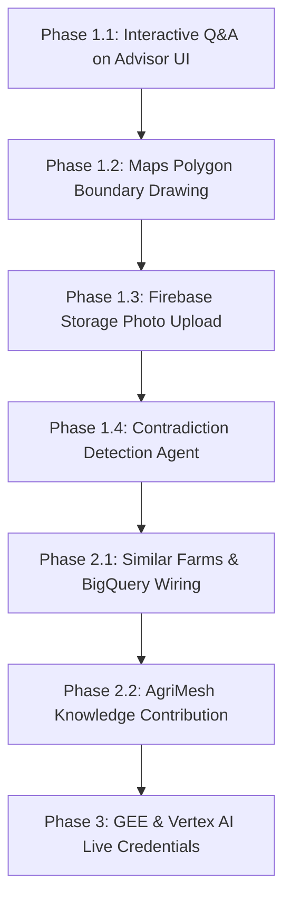

# AgriOS — PDF Gap to Implementation Plan

**Document Version:** 1.0.0  
**Phase:** Planning & Audit (Pre-Execution)  
**Objective:** Close all remaining discrepancies between the official AgriOS PDFs and the current codebase in strict dependency order.

---

## 1. Executive Implementation Priority Order

### Phase 1: P0 Critical Gaps (Demo & Core Journey Integrity)
1. **Interactive Advisor Q&A Input on UI (`REQ-36`)**:
   - *Target File:* `src/app/farm/[id]/advisor/page.tsx`
   - *Task:* Connect the existing backend function `askFarmerAdvisor(ctx, question)` to an interactive query bar on the Advisor page so the farmer can type/ask "What should I do today and why?" and view streaming evidence + confidence.
2. **Google Maps Polygon Boundary Drawing (`REQ-04`)**:
   - *Target File:* `src/components/maps/FarmLocationPicker.tsx`
   - *Task:* Enable multi-point polygon boundary selection via Google Maps Drawing Manager or interactive polygon vertex clicking, saving GeoJSON `Polygon` coordinates to `farm.boundary`.
3. **Firebase Storage Photo Persistence (`REQ-07`)**:
   - *Target Files:* `src/lib/firebase/firestore.ts`, `src/app/api/disease/route.ts`
   - *Task:* Upload scanned crop leaves to Firebase Cloud Storage (`agrios-7c269.firebasestorage.app`) via `uploadBytes`, storing permanent photo URLs alongside diagnostic records in Firestore.
4. **Contradiction & Sensor Dispute Detection in Evidence Agent (`REQ-30`)**:
   - *Target File:* `src/lib/ai/orchestrator.ts`
   - *Task:* Implement explicit conflict detection heuristics (e.g. declining satellite NDVI vs. farmer observation of lush vegetative growth, or imminent heavy rainfall vs. farmer irrigation schedule) with uncertainty penalties.

---

### Phase 2: P1 MVP Enhancements (Analytics & Cooperation)
5. **Similar Farms Discovery & BigQuery Analytics Wiring (`REQ-10`, `REQ-35`)**:
   - *Target Files:* `src/app/api/farms/similar/route.ts`, `src/components/farm/SimilarFarmsCohort.tsx`, `src/app/farm/[id]/page.tsx`
   - *Task:* Implement algorithmic farm similarity matching (matching by crop, soil pH, irrigation, agro-climatic state) and wire `bigQueryService.ts` historical price trends to a dedicated UI analytics widget.
6. **AgriMesh Practice Contribution & Download Flow (`REQ-23`)**:
   - *Target File:* `src/app/agrimesh/page.tsx`
   - *Task:* Allow farmers to share a regenerative technique (e.g., zero-tillage, bio-fertilizer) into the simulated AgriMesh knowledge stream and inspect cross-border practices from Brazil/South Africa.
7. **Bhuvan / ISRO Geospatial Context & FAO References (`REQ-16`, `REQ-17`)**:
   - *Target File:* `src/lib/services/agriculture/geospatialService.ts`
   - *Task:* Add Bhuvan Indian agro-climatic zoning data and FAOSTAT crop yield reference documentation.

---

### Phase 3: P2 Advanced Features (Conditional on Cloud Credentials)
8. **Live Google Earth Engine Custom Polygon Reduction (`REQ-03`, `REQ-19`)**:
   - Requires: `GEE_SERVICE_ACCOUNT_KEY`.
   - Compute real-time Sentinel-2 median NDVI over farmer-drawn GeoJSON polygons.
9. **Vertex AI Custom AutoML Serving (`REQ-02`)**:
   - Requires: `VERTEX_AI_YIELD_ENDPOINT_ID`.
   - Call trained custom regression neural models on Google Cloud Vertex AI endpoints.
10. **Cloud Functions Event-Driven Background Jobs (`REQ-09`)**:
    - Scheduled nightly data refresh of IMD forecasts and Agmarknet prices via Firebase Cloud Functions.

---

## 2. Dependency Architecture Graph

---

## 3. Strict Quality Rules Before Code Execution
- **No Mocking of Live Streams:** All external features lacking keys must retain honest labeled fallbacks (`isDemo: true`).
- **Preserve Existing Working Features:** No regressions to live weather, data.gov.in mandi streaming, or Firebase authentication.
- **Verification Gate:** Every change must pass `npm test`, `npm run lint` (0 warnings), and `npm run build` cleanly before merging.
